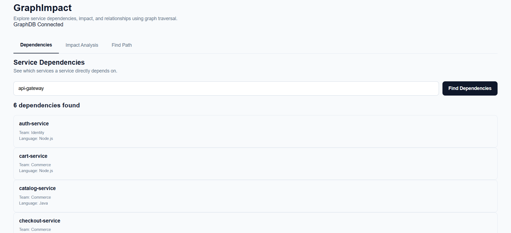
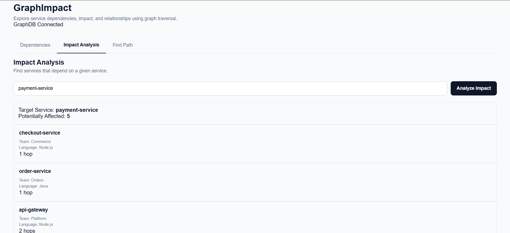
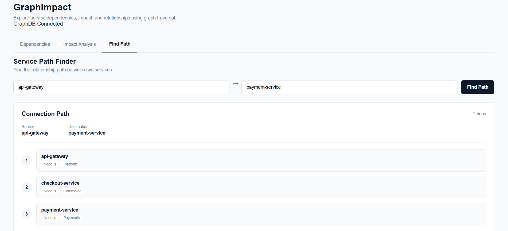

# GraphImpact — Service & Package Dependency Explorer

A graph-database application for exploring how microservices and their third-party packages depend on one another, built for the Wexa AI take-home assignment. GraphImpact answers the question every platform/SRE team eventually asks in a panic: **"If this thing breaks, what else breaks with it?"**

- **Repo:** https://github.com/Hrishikesh-mandal/graphImpact-graphDB
- **Live demo:** https://graph-impact-graph-db.vercel.app
- **Stack:** React (Vite) frontend · Node.js/Express backend · CognoDB (Neo4j-compatible, Bolt) as the graph database

---

## 1. The use case

Modern backends are rarely a handful of independent services — they're a mesh of services calling services, and services pulling in shared npm/PyPI/Maven packages. Two questions come up constantly during incident response and dependency upgrades:

1. **"What depends on this service, directly or transitively?"** — before I deploy a breaking change to `payment-service`, who gets hurt?
2. **"What breaks if I bump/remove this package?"** — if `axios` has a CVE, which services (and which teams) need to patch?

GraphImpact models an organization's repositories, services, and packages as a graph, and lets anyone — not just the engineer who happens to remember the architecture diagram — trace blast radius in a few clicks instead of grepping through a dozen repos.

### Why a graph database?

In a relational schema, "who is affected by a change to `payment-service`, at any depth" is a **recursive, unbounded-depth traversal** — in Postgres it means a recursive CTE per query, re-joining a `service_dependencies` edge table against itself for every hop, and it gets slower and uglier as the chain gets deeper. In CognoDB it's one Cypher pattern:

```cypher
MATCH path = (affected:Service)-[:DEPENDS_ON*1..5]->(target:Service {name: $name})
RETURN affected, length(path) AS depth
```

The relationships (`DEPENDS_ON`, `USES`, `CONTAINS`) are first-class, indexed citizens rather than foreign-key columns, so:

- **Variable-depth impact analysis** (1 hop or 5 hops, we don't know in advance) is a single query instead of N recursive joins.
- **Shortest-path discovery** between two services ("how does `checkout-service` reach `analytics-service`?") is native (`shortestPath`-style traversal) instead of a graph algorithm hand-rolled in application code.
- The domain itself — services calling services, services using packages, packages depending on packages — _is_ a graph; storing it as one avoids the impedance mismatch of flattening a network into rows.

This is also exactly the kind of query a relational database handles awkwardly: a join across an unknown, data-dependent number of tables (or self-joins) is precisely where SQL's fixed-shape queries strain.

---

## 2. Data model

```
(:Repository {name, githubUrl, owner})
        │
        │ CONTAINS
        ▼
(:Service {name, language, team}) ──USES──▶ (:Package {name, version, ecosystem, description})
        │                                            │
        │ DEPENDS_ON (Service → Service)              │ DEPENDS_ON (Package → Package)
        ▼                                            ▼
(:Service)                                    (:Package)
```

**Nodes**

| Label        | Properties                                    |
| ------------ | --------------------------------------------- |
| `Repository` | `name`, `githubUrl`, `owner`                  |
| `Service`    | `name`, `language`, `team`                    |
| `Package`    | `name`, `version`, `ecosystem`, `description` |

**Relationships**

| Type         | Direction              | Meaning                                  |
| ------------ | ---------------------- | ---------------------------------------- |
| `CONTAINS`   | `Repository → Service` | Which repo a service lives in            |
| `DEPENDS_ON` | `Service → Service`    | Service-to-service call dependency       |
| `USES`       | `Service → Package`    | Service depends on a third-party package |
| `DEPENDS_ON` | `Package → Package`    | Transitive package dependency            |

The seed data (`backend/seed/`) models a small e-commerce platform: 9 repositories, 15 services (`api-gateway`, `auth-service`, `catalog-service`, `payment-service`, `fraud-service`, `notification-service`, etc.) across 6 teams, and 15 shared packages (`express`, `axios`, `stripe`, `kafkajs`, `redis`, …), wired together with realistic call and package-usage edges.

---

## 3. Cypher queries

All queries live in `backend/src/queries/graphQueries.js` and are run as **parameterised** statements through the official `neo4j-driver` (no string concatenation).

| Query                      | What it does                                                                                          | Notes                                                                        |
| -------------------------- | ----------------------------------------------------------------------------------------------------- | ---------------------------------------------------------------------------- |
| `GET_SERVICE_DEPENDENCIES` | Direct (1-hop) dependencies of a service                                                              | Simple lookup                                                                |
| `GET_SERVICE_IMPACT`       | Every service that transitively depends on a target service, up to 5 hops, with the depth of each     | **Multi-hop traversal** (`*1..5`) — the "blast radius" query, awkward in SQL |
| `GET_PACKAGE_USERS`        | Every service that uses a given package directly                                                      | Simple lookup                                                                |
| `GET_PACKAGE_IMPACT`       | Every service transitively affected by a package (via `USES` then `DEPENDS_ON*0..5` between packages) | **Multi-hop traversal** across two relationship types                        |
| `FIND_PATH`                | Shortest dependency chain between two named services (up to 10 hops)                                  | Path-finding, natively awkward in a relational model                         |

Example — "what breaks if `payment-service` goes down?":

```cypher
MATCH path = (affected:Service)-[:DEPENDS_ON*1..5]->(target:Service {name: $name})
RETURN affected { .name, .language, .team } AS service, length(path) AS depth
ORDER BY depth, service.name
```

---

## 4. Data & Seed Dataset

The project includes the sample datasets required to populate the CognoDB graph.

The datasets are stored in the repository under:

```text
backend/
└── seed/
    ├── data/
    │   ├── services.js
    │   ├── packages.js
    │   └── repositories.js
    └── seed.js
```
---

## 5. Application

- **Backend** (`/backend`): Express REST API, layered as `routes → controllers → services → queries`, with a Neo4j driver session opened per request and centralized error handling for a graceful message when CognoDB is unreachable.
- **Frontend** (`/frontend`): React + Vite dashboard with tabs for Service Dependencies, Impact Analysis, and Path Finder, so a non-technical user can search a service/package by name and see who depends on it without writing Cypher.

### API endpoints

| Method | Route                              | Description                                   |
| ------ | ---------------------------------- | --------------------------------------------- |
| `GET`  | `/health`                          | Health check                                  |
| `GET`  | `/api/services/:name/dependencies` | Direct dependencies of a service              |
| `GET`  | `/api/services/:name/impact`       | Everything transitively affected by a service |
| `GET`  | `/api/packages/:name/impact`       | Everything transitively affected by a package |
| `GET`  | `/api/path?source=&target=`        | Shortest dependency path between two services |

---

## 6. Setup & running locally

### 6.1 Create a CognoDB instance

1. Sign up at [console.cognodb.com/signup](https://console.cognodb.com/signup) (free, no credit card).
2. Create a free **c0** instance and pick a region — it provisions in under a minute.
3. Copy the connection URI (`bolt+s://<instance-id>.databases.cognodb.cloud`) and the generated password for user `cognodb` — the password is shown once.

### 6.2 Backend

```bash
cd backend
npm install
cp .env.example .env
```

Fill in `.env`:

```
COGNODB_USERNAME=cognodb
COGNODB_URI=bolt+s://<instance-id>.databases.cognodb.cloud
COGNODB_PASSWORD=<your generated password>
PORT=5000
```

Verify the connection, seed the graph, then start the API:

```bash
npm run test:connection   # sanity-checks the CognoDB connection
npm run seed               # clears and loads repositories, services, packages, and edges
npm run dev                 # starts the API on http://localhost:5000
```

### 6.3 Frontend

```bash
cd frontend
npm install
```

Create a `.env` file with the backend URL:

```
VITE_API_URL=http://localhost:5000
```

```bash
npm run dev   # starts the app on http://localhost:5173
```

---

## 7. Deployment

The frontend is deployed on Vercel: https://graph-impact-graph-db.vercel.app. The backend can be deployed to any Node host (Render/Railway/Fly.io) — set the same `COGNODB_*` environment variables there and point the frontend's `VITE_API_URL` at it.

---

## 8. Screenshots

### Service Dependencies

The Dependencies view shows the direct dependencies of a selected service.



### Impact Analysis

The Impact Analysis view shows downstream services affected through dependency relationships.



### Find Path

The Path Finder shows the relationship path between two services.


---

## Demo video

